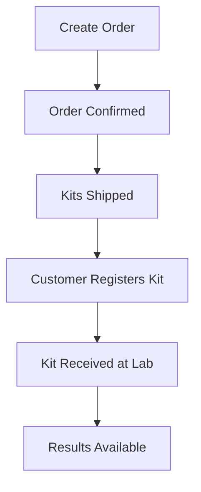

# C4HXP API Documentation

Welcome to the C4HXP Laboratory Management API documentation. This comprehensive guide will help you integrate with our platform to create orders, track kits, and access test results.

## 🚀 Quick Start

New to the C4HXP API? Start here:

1. **[Getting Started Guide](getting-started.md)** - Complete setup walkthrough
2. **[Authentication](authentication.md)** - API key setup and security
3. **[API Reference](api-reference.md)** - Complete endpoint documentation

### 5-Minute Integration

```python
from c4hxp_client import C4HXPClient

# Initialize client
client = C4HXPClient(
    api_key="c4hxp_live_your_key",
    api_secret="your_secret"
)

# Create an order
order = client.orders.create({
    "recipient": {
        "first_name": "John",
        "last_name": "Doe",
        "email": "john@example.com",
        "phone": "+1234567890",
        "address": {
            "street1": "123 Main St",
            "city": "Anytown",
            "state": "CA",
            "zip": "12345",
            "country": "US"
        }
    },
    "kit_types": ["hormone_panel"]
})

print(f"Order created: {order.order_number}")
```

## 📚 Documentation Sections

### Core API Documentation

| Document | Description |
|----------|-------------|
| **[API Reference](api-reference.md)** | Complete endpoint documentation with examples |
| **[Authentication](authentication.md)** | API key management and security best practices |
| **[Rate Limits](rate-limits.md)** | Usage limits and optimization strategies |
| **[Error Handling](error-handling.md)** | Error codes, troubleshooting, and solutions |
| **[Webhooks](webhooks.md)** | Real-time event notifications setup |

### SDKs and Libraries

| Language | Package | Documentation |
|----------|---------|---------------|
| **Python** | `c4hxp-client` | [Python SDK Guide](../sdks/python/README.md) |
| **JavaScript** | `@c4hxp/api-client` | [JavaScript SDK Guide](../sdks/javascript/README.md) |
| **PHP** | `c4hxp/api-client` | [PHP SDK Guide](../sdks/php/README.md) |

### Integration Examples

| Technology | Examples |
|------------|----------|
| **Python** | [Python Examples](../examples/python/README.md) |
| **JavaScript** | [JavaScript Examples](../examples/javascript/README.md) |
| **cURL** | [cURL Examples](../examples/curl/README.md) |
| **Postman** | [Postman Collection](../examples/postman/README.md) |

## 🔗 API Overview

The C4HXP API is organized around REST principles with predictable resource-oriented URLs, JSON-encoded requests and responses, and standard HTTP response codes.

### Base URL
```
Production:  https://api.c4hxp.com/v2/public/
Staging:     https://staging.api.c4hxp.com/v2/public/
```

### Key Features

- **Simple Authentication**: API key-based authentication
- **RESTful Design**: Intuitive resource-based endpoints
- **Real-time Updates**: Webhook notifications for events
- **Comprehensive SDKs**: Native libraries for popular languages
- **Rate Limiting**: Fair usage policies with clear limits
- **Detailed Errors**: Descriptive error messages for debugging

## 🛠️ Core Workflows

### 1. Order Management Flow



### 2. Kit Lifecycle

| Status | Description | Next Steps |
|--------|-------------|------------|
| `created` | Kit created in system | Ship to customer |
| `shipped` | Kit shipped to customer | Customer registers |
| `registered` | Customer registered kit | Ship to lab |
| `in_lab` | Kit received at laboratory | Process sample |
| `completed` | Results available | Notify customer |

### 3. Result Access

```python
# Get test results
results = client.results.get_by_kit("123456789012")

# Download PDF report
pdf_data = client.results.download_pdf("123456789012")
with open("results.pdf", "wb") as f:
    f.write(pdf_data)
```

## 🔐 Authentication

All API requests require authentication using API keys:

```http
Authorization: Api-Key {key_id}:{secret}
```

**API Key Types:**
- **Partner Keys**: Healthcare partners and integrations (1,000 req/hour)
- **E-commerce Keys**: Online platforms and marketplaces (500 req/hour)
- **Development Keys**: Testing and development (100 req/hour)

## 📊 Rate Limits

| Key Type | Requests/Hour | Requests/Day |
|----------|---------------|--------------|
| Partner | 1,000 | 10,000 |
| E-commerce | 500 | 5,000 |
| Development | 100 | 1,000 |

Rate limit information is included in response headers:
```http
X-RateLimit-Limit: 1000
X-RateLimit-Remaining: 847
X-RateLimit-Reset: 1705315200
```

## 🔔 Webhooks

Subscribe to real-time events instead of polling:

```json
{
  "event": "results.available",
  "data": {
    "kit_barcode": "123456789012",
    "patient": {
      "first_name": "Jane",
      "last_name": "Smith"
    },
    "completed_at": "2024-01-25T16:45:00Z"
  }
}
```

**Available Events:**
- `order.created` - New order created
- `order.shipped` - Kits shipped to customer
- `kit.registered` - Customer registered kit
- `results.available` - Test results ready

## 🚨 Error Handling

The API uses standard HTTP status codes and provides detailed error information:

```json
{
  "error": {
    "code": "VALIDATION_ERROR",
    "message": "Invalid request parameters",
    "details": [
      {
        "field": "recipient.email",
        "issue": "Invalid email format"
      }
    ]
  },
  "meta": {
    "request_id": "req_abc123",
    "timestamp": "2024-01-15T10:30:00Z"
  }
}
```

## 🧪 Testing

### Staging Environment

Test your integration safely in our staging environment:

```python
client = C4HXPClient(
    api_key="c4hxp_test_your_key",
    api_secret="your_test_secret",
    base_url="https://staging.api.c4hxp.com/v2/public/"
)
```

### Sample Data

Use our sample data for testing:
- Test kit types: `hormone_panel`, `basic_metabolic`
- Sample barcodes: `123456789012`, `123456789013`
- Test patient data included in examples

## 📈 Monitoring

### Health Check

Monitor API availability:

```http
GET /v2/public/health
```

```json
{
  "data": {
    "status": "healthy",
    "version": "2.0.0",
    "uptime_seconds": 1234567
  }
}
```

### Request IDs

Every response includes a unique request ID for tracking:

```json
{
  "meta": {
    "request_id": "req_abc123",
    "timestamp": "2024-01-15T10:30:00Z"
  }
}
```

## 🆘 Support

### Getting Help

- **Documentation Issues**: Found an error? [Contact us](mailto:api-support@c4hxp.com)
- **Integration Support**: Need help integrating? [Get support](mailto:api-support@c4hxp.com)
- **API Status**: Check service status at [status.c4hxp.com](https://status.c4hxp.com)

### Support Channels

| Channel | Use Case | Response Time |
|---------|----------|---------------|
| **Email** | api-support@c4hxp.com | 4-24 hours |
| **Documentation** | General questions | Immediate |
| **Status Page** | Service issues | Real-time |

### When Contacting Support

Include these details for faster resolution:

1. **Request ID** from API responses
2. **API key ID** (not the secret!)
3. **Timestamp** of the issue
4. **Error messages** or unexpected behavior
5. **Code samples** (remove sensitive data)

## 🗺️ Migration Guides

### From v1 to v2

Key changes in v2:
- New authentication format
- Improved error responses
- Enhanced webhook payloads
- Simplified endpoint structure

See our [Migration Guide](migration-v1-to-v2.md) for detailed instructions.

## 📝 Changelog

Stay updated with API changes:

- **[Full Changelog](../CHANGELOG.md)** - Complete version history
- **[Breaking Changes](breaking-changes.md)** - Important updates
- **[Deprecation Notice](deprecations.md)** - Upcoming changes

## 🎯 Next Steps

Ready to start integrating? Here's your roadmap:

1. **[Get API Keys](authentication.md#getting-api-keys)** - Request access credentials
2. **[Install SDK](../sdks/python/README.md)** - Choose your preferred language
3. **[Run Examples](../examples/python/README.md)** - Try our sample code
4. **[Set Up Webhooks](webhooks.md)** - Configure real-time notifications
5. **[Go to Production](production-checklist.md)** - Launch your integration

## 🤝 Community

- **GitHub**: [Issues and discussions](https://github.com/c4hxp/api-client)
- **Stack Overflow**: Tag questions with `c4hxp-api`
- **Community Forum**: [forum.c4hxp.com](https://forum.c4hxp.com)

---

**Need immediate help?** Check our [troubleshooting guide](troubleshooting.md) or [contact support](mailto:api-support@c4hxp.com). 