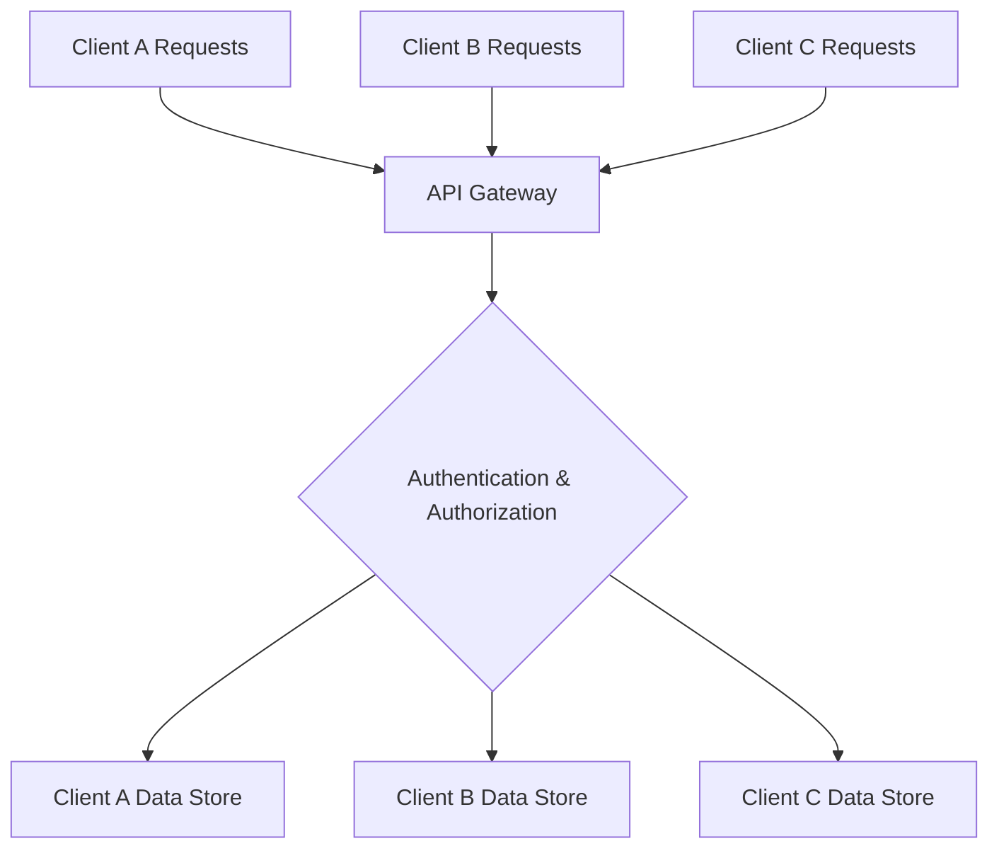
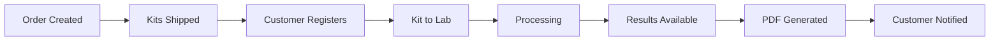
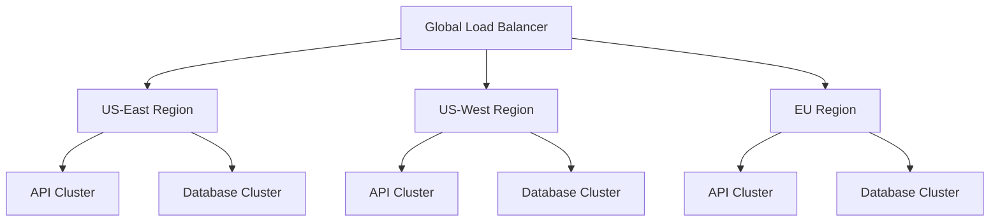

# Platform Overview

Complete diagnostic test kit management solution with enterprise-grade APIs.

## 🏗️ **Architecture**

### **Dual API Design**

The C4HXP platform provides two specialized APIs designed for different use cases:

#### 🌐 **Public API** - Customer & Partner Integration
**Base URL:** `https://api.c4hxp.com/v2/public/`

**Perfect for:**
- Healthcare providers and patient portals
- Ecommerce platforms and marketplaces
- Third-party integrations and apps

**Core Capabilities:**
- Order creation and management
- Kit tracking and status updates
- Result retrieval and PDF generation
- Real-time webhook notifications
- Test catalog browsing

**Security Features:**
- Multi-tenant data isolation
- Scope-based API permissions
- Rate limiting and abuse prevention
- Comprehensive audit logging

#### 🔒 **Internal API** - Business Operations
**Base URL:** `https://api.c4hxp.com/v2/internal/`

**Perfect for:**
- Laboratory integrations and LIMS
- Business operations and analytics
- Administrative and management systems
- Advanced automation workflows

**Core Capabilities:**
- Complete CRUD operations on all resources
- Lab integration and HL7 processing
- Business analytics and reporting
- Administrative functions and user management
- Advanced monitoring and system controls

## 🔐 **Enterprise Security**

### **Multi-Tenant Data Isolation**



**Key Security Features:**
- **Complete Client Separation**: Each organization's data is completely isolated
- **Zero Data Leakage**: Impossible for clients to access each other's data
- **Database-Level Security**: Enforced at the repository level
- **Automatic Enforcement**: No configuration required - security is built-in

### **Compliance & Standards**
- **HIPAA Considerations**: Built with healthcare data security in mind
- **SOC 2 Ready**: Comprehensive logging and access controls
- **Data Encryption**: All data encrypted in transit and at rest
- **Audit Trails**: Complete request and data access logging

## 📊 **Platform Capabilities**

### **Complete Test Kit Lifecycle**



### **Core Features**

| Feature Category | Capabilities |
|-----------------|-------------|
| **Order Management** | Multi-kit orders, recipient management, provider tracking, automated fulfillment |
| **Kit Lifecycle** | Registration, real-time tracking, status updates, chain of custody |
| **Result Management** | Secure storage, PDF reports, multi-format delivery, history archiving |
| **Lab Integration** | HL7 processing, LIMS integration, automated result ingestion |
| **Communications** | Email/SMS notifications, webhooks, custom templates, multi-language |

### **Available Test Panels**

| Category | Examples | Biomarkers |
|----------|----------|------------|
| **Hormone Testing** | Comprehensive Hormone Panel, Thyroid Complete | TSH, Free T3/T4, Cortisol, DHEA-S, Testosterone, Estradiol |
| **Metabolic Health** | Basic Metabolic Panel, Diabetes Screening | Glucose, HbA1c, Lipid Panel, Insulin, C-Peptide |
| **Wellness Screening** | Vitamin Panel, Inflammation Markers | Vitamin D, B12, Folate, CRP, ESR |
| **Specialty Testing** | Food Sensitivity, Micronutrient Analysis | IgG Food Panel, Vitamins, Minerals, Antioxidants |

## 🚀 **Integration Patterns**

### **1. Healthcare Provider Integration**

```python
# Create order for patient
order = client.orders.create({
    "recipient": {
        "first_name": "Jane",
        "last_name": "Smith",
        "email": "jane@example.com",
        "phone": "+1234567890"
    },
    "kit_types": ["hormone_panel"],
    "provider_reference": "PATIENT_12345",
    "metadata": {
        "clinic_id": "CLINIC_001",
        "provider_name": "Dr. Johnson"
    }
})
```

### **2. Ecommerce Platform Integration**

```javascript
// Browse available tests
const kitTypes = await client.catalog.getKitTypes();

// Create order from purchase
const order = await client.orders.create({
    recipient: customerData,
    kitTypes: cartItems.map(item => item.kitType),
    metadata: {
        ecommerce_order_id: "ORDER_98765",
        campaign_source: "health_week_promo"
    }
});

// Handle webhook notifications
app.post('/webhooks/c4hxp', (req, res) => {
    const { event, data } = req.body;
    
    switch (event) {
        case 'order.shipped':
            updateOrderStatus(data.order_id, 'shipped');
            notifyCustomer(data.recipient.email, 'tracking_info');
            break;
        case 'results.available':
            notifyCustomer(data.patient.email, 'results_ready');
            break;
    }
});
```

### **3. Laboratory Integration**

```python
# Receive new orders for processing
pending_orders = internal_client.orders.list(status='pending_lab')

# Update sample processing status
internal_client.events.create_sample_event({
    "sample_id": 123,
    "status": "received_at_lab",
    "timestamp": "2024-01-15T10:30:00Z",
    "details": "Sample received and logged into LIMS"
})

# Submit test results
internal_client.results.create({
    "kit_id": 456,
    "test_results": [
        {
            "biomarker": "TSH",
            "value": 2.1,
            "unit": "mIU/L",
            "reference_range": "0.4-4.0",
            "status": "normal"
        }
    ],
    "lab_reference": "LAB_REF_789",
    "completed_at": "2024-01-18T14:30:00Z"
})
```

## 📈 **Performance & Reliability**

### **Platform Metrics**

| Metric | Performance |
|--------|-------------|
| **Uptime SLA** | 99.9% availability |
| **Response Time** | <200ms average |
| **Throughput** | 10,000+ orders/month |
| **Scalability** | Auto-scaling infrastructure |
| **Global Reach** | CDN-powered worldwide |

### **Monitoring & Analytics**

- **Real-time Monitoring**: System health and performance dashboards
- **Usage Analytics**: API usage patterns and business insights
- **Error Tracking**: Proactive issue identification and resolution
- **Custom Dashboards**: Business intelligence integration support

## 🔧 **Technical Specifications**

### **API Standards**
- **REST Architecture**: Standard HTTP methods and status codes
- **JSON Format**: Consistent request/response structure
- **OpenAPI 3.0**: Complete API specification and documentation
- **Semantic Versioning**: Backward-compatible versioning strategy

### **Authentication & Authorization**
- **API Key Authentication**: Secure key-based access control
- **Scope-Based Permissions**: Granular endpoint access control
- **Environment Separation**: Production, staging, and development keys
- **Key Management**: Rotation, monitoring, and audit capabilities

### **SDKs and Integration Support**
- **Python SDK**: `pip install c4hxp-client`
- **JavaScript SDK**: `npm install @c4hxp/api-client`
- **PHP SDK**: `composer require c4hxp/api-client`
- **REST API**: Direct HTTP integration for any language

## 🌍 **Global Infrastructure**

### **Deployment Architecture**



### **Security & Compliance**
- **Data Encryption**: TLS 1.3 in transit, AES-256 at rest
- **Network Security**: VPC isolation, private subnets, security groups
- **Access Control**: IAM policies, MFA, principle of least privilege
- **Compliance**: SOC 2, HIPAA considerations, GDPR ready

## 📚 **Documentation & Support**

### **Developer Resources**
- **[API Reference](api-reference.md)**: Complete endpoint documentation
- **[Authentication Guide](authentication.md)**: Security and key management
- **[SDK Documentation](../sdks/)**: Language-specific guides
- **[Code Examples](../examples/)**: Working integration samples

### **Support Channels**
- **Technical Documentation**: Comprehensive guides and tutorials
- **Developer Support**: Email and chat support for technical issues
- **Community Forum**: Developer community and knowledge sharing
- **Status Page**: Real-time system status and incident updates

---

## 🎯 **Next Steps**

Ready to explore the C4HXP platform?

1. **[Review API Reference](api-reference.md)** - Understand the complete API
2. **[Try the SDKs](../sdks/)** - Install and test in your preferred language
3. **[Explore Examples](../examples/)** - See working integration code
4. **[Contact Sales](mailto:technical-sales@c4hxp.com)** - Discuss your specific needs

For detailed business benefits and ROI analysis, see our **[Executive Brief](executive-brief.md)**. 